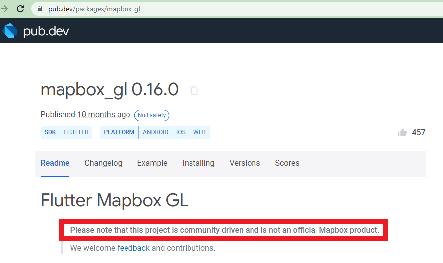
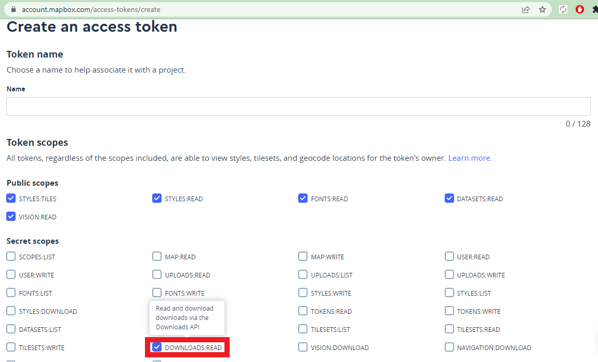
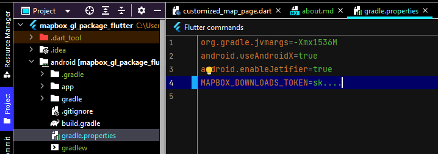
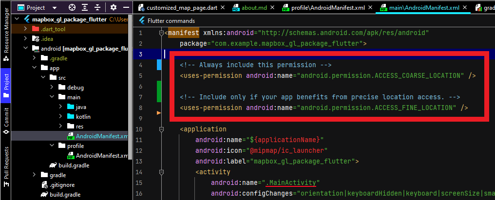

## 1. Research: Mapbox GL Package Flutter

- Keywords:
    - Mapbox gl package flutter
    - mapbox gl flutter
    - mapbox-flutter
    - mapbox flutter marker
    - mapbox/flutter github
    - mapbox gl pub dev
    - flutter-mapbox gl example
    - mapbox-gl flutter tutorial
    - mapbox flutter example
    - mapbox-flutter documentation
    - mapbox flutter tutorial
    - mapbox custom marker
    - mapbox flutter desktop
    - flutter mapbox navigation
    - mapbox_gl
- Video Title: Mapbox_GL Package in Flutter - Mapbox_GL package tutorial and example with markers

## 2. Research: Competitors

**Flutter Videos/Articles**

- 2.3K: https://www.youtube.com/watch?v=oExKvqVKiAM
- 11K: https://www.youtube.com/watch?v=VnzpLw357-I
- https://pub.dev/packages/mapbox_gl
- https://www.mapbox.com/
- https://docs.mapbox.com/
- https://docs.mapbox.com/android/maps/guides/install/
- https://morioh.com/p/38818a701008
- https://pub.dev/documentation/mapbox_gl/latest/
- https://dhruvnakum.xyz/flutter-mapbox-integration-complete-guide-with-example
- https://docs.mapbox.com/help/getting-started/add-markers/
- https://ayoub-boumzebra.medium.com/flutter-display-map-markers-and-polyline-using-mapbox-59cb9b1df2da
- https://medium.com/nerd-for-tech/navigation-with-mapbox-for-flutter-apps-313687778686
- https://morioh.com/p/1bf3c1cb39db

**Android/Swift/React Videos**

- 1K: https://www.youtube.com/watch?v=2jOAStzmPcM
- 1K: https://www.youtube.com/watch?v=jJamy2XJNuk
- 3K: https://www.youtube.com/watch?v=0OTk6KFsTvU
- 871: https://www.youtube.com/watch?v=BkKLMs5_fCk
- 834: https://www.youtube.com/watch?v=i5ZHi9OTfaA
- 721: https://www.youtube.com/watch?v=977cTDqB_8I
- 106: https://www.youtube.com/watch?v=Xw0haMrTRbY
- 4.1K: https://www.youtube.com/watch?v=HXP12DNwoLQ
- 11K: https://www.youtube.com/watch?v=dKhaQScITEw
- 4.6K: https://www.youtube.com/watch?v=ojDB7Qt_6U8
- https://docs.mapbox.com/android/maps/guides/
- https://www.kodeco.com/378151-mapbox-tutorial-for-android-getting-started
- https://docs.mapbox.com/ios/maps/guides/
- https://github.com/mapbox/mapbox-maps-ios
- https://www.createwithswift.com/tutorial-integrating-mapbox-with-swiftui/
- https://cocoapods.org/pods/Mapbox-iOS-SDK
- https://docs.mapbox.com/help/glossary/maps-sdk-for-react-native/
- https://www.npmjs.com/package/@react-native-mapbox-gl/maps
- https://www.waldo.com/blog/mapbox-react-native
- https://www.codementor.io/@danielamah/ultimate-guide-to-integrating-react-native-with-mapboxgl-a-google-map-alternative-19zkltyrqz

**Great Features**

- It is used for integrating Mapbox Maps inside flutter application on Android, iOS and web
  platforms.
- Find more features
  at [https://pub.dev/documentation/mapbox_gl/latest/](https://pub.dev/documentation/mapbox_gl/latest/)
  .

**Problems from Videos**

- **Question:** Is it possible to use offline map or there is any example package to do that?
  <br/> **Answer:**  Yes, this
  package [https://pub.dev/packages/mapbox_gl](https://pub.dev/packages/mapbox_gl) has an option to
  use offline maps.
  Reference: [https://github.com/flutter-mapbox-gl/maps/tree/master/example/lib](https://github.com/flutter-mapbox-gl/maps/tree/master/example/lib)
  .

**Problems from Flutter Stackoverflow**

- https://stackoverflow.com/questions/75338431/problem-running-flutter-with-mapbox-gl-in-ios
- https://stackoverflow.com/questions/71109921/flutter-error-mapbox-java-lang-illegalaccesserror-when-building-in-release-mode
- https://stackoverflow.com/questions/75867505/package-mapbox-gl-flutter-raised-exception
- https://stackoverflow.com/questions/59492029/web-capability-with-flutter-package-mapbox-gl
- https://stackoverflow.com/questions/70697057/flutter-mapbox-error-unauthorized-401-error-when-building-app-for-android/75963805

## 3. Video Structure

**Main Points / Purpose Of Lesson**

1. In this video tutorial, I will teach you how to integrate mapbox api inside flutter application
   on Android, iOS and web platforms and use your own google map styling in map of your app.
2. Main points:
    - Simple Map Page
    - Customized Map Page (Add customization and styling in the map using mapbox website)
    - Pin on Map Page (Add custom symbols or markers in your app)
3. By this plugin, you have full control over your maps.

**The Structured Main Content**

1. Run `dart pub add mapbox_gl` in terminal to add `mapbox_gl` package in your flutter app.
2. Get the API key of mapbox:

- First of all, sign up on [https://www.mapbox.com/](https://www.mapbox.com/) if you don't have
  already an account. Otherwise sign in.
- Then, visit android documentation of
  mapbox [https://docs.mapbox.com/android/maps/guides/install/](https://docs.mapbox.com/android/maps/guides/install/)
  for configuration of android version of your project.
- As said by the developer **this project is community driven and is not an official Mapbox
  product**.
  <br/>
  So, do only
  the [Configure credentials](https://docs.mapbox.com/android/maps/guides/install/#configure-credentials)
  in order to run android project here in flutter.
    - Don't generate public access token.
    - Generate a secret access token with the **Downloads:Read** scope
      from [here](https://account.mapbox.com/access-tokens/create).
      
    - You will use this secret key in `accessToken` property of `MapboxMap` widget in your flutter
      project.
    - Add your secret key in android/gradle.properties
      as `MAPBOX_DOWNLOADS_TOKEN=YOUR_SECRET_MAPBOX_ACCESS_TOKEN`.
      
    - In the last, add location permission in manifest property of
      android/app/src/main/AndroidManifest.xml

```xml

<uses-permission android:name="android.permission.ACCESS_COARSE_LOCATION" />

<uses-permission android:name="android.permission.ACCESS_FINE_LOCATION" />
```

as shown in image:


3. `main.dart` file is calling `MyApp` widget in `my_app.dart` file.
   <br/>All theming properties are defined in `MyApp` class.
   <br/>`MyApp` class is calling `HomePage` class from `home_page.dart` file.
4. In `home_page.dart` file, there are three `ElevatedButton`s.

- Simple Map Page
- Customized Map Page
- Pin on Map Page

5. In `simple_map_page.dart`